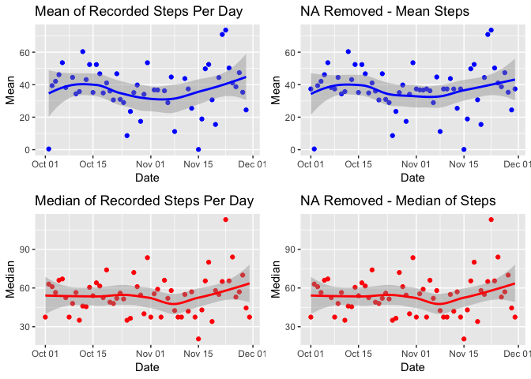

### Loading and preprocessing the data
Load the reqired libaries 


```r
library(dplyr)
library(readr)
library(ggplot2)
library(gridExtra)
```

Load the data into a dataframe

```r
url <- "https://d396qusza40orc.cloudfront.net/repdata%2Fdata%2Factivity.zip"

if(!file.exists("activity.csv")) {
  download.file(url, destfile="repdata%2Fdata%2Factivity.zip")
  unzip(zipfile ="repdata%2Fdata%2Factivity.zip" )
}
activityDF <- read_csv(file = "activity.csv")
```

### Histogram of total steps taken each day


```r
ggplot(data = activityDF, aes(date, steps)) + geom_histogram(stat = "identity")
```

<!-- -->

### Mean and Median number of steps each day
Lets Plot Date across the X and use tapply to get the mean of steps for the Y axis. 
I am using qplot because I need the practice.  Same reason for using both tapply and Summarize.


```r
# Mean
plot1 <- qplot(y= tapply(activityDF$steps, activityDF$date, mean, na.rm = TRUE), x = unique(activityDF$date),
      geom=c("point", "smooth"), xlab="Date", ylab="Mean", 
      main = "Mean of Recorded Steps Per Day", color = I("blue"))

plot1
```

<!-- -->

```r
# Median using summarize
medianStepsTable <- activityDF[activityDF$steps != 0,]  %>% 
  group_by(date) %>% 
  summarize(median_steps = median(steps, na.rm=TRUE))

plot2 <- qplot(y= medianStepsTable$median_steps, x = medianStepsTable$date, geom=c("point", "smooth"), xlab="Date", ylab="Median", main = "Median of Recorded Steps Per Day", color=I("red"))

plot2
```

<!-- -->

### Average Daily Activity Pattern


```r
act_by_intvl<- activityDF %>% 
  group_by(interval) %>% 
  summarize(mean_by_Interval = mean(steps, na.rm= TRUE))

ggplot(act_by_intvl, aes(x=act_by_intvl$interval, y=act_by_intvl$mean_by_Interval)) + geom_line() + labs(x="5-minute Interval", y= "Average Activity in Steps", title ="Average Steps per Daily Interval Chunk")
```

<!-- -->


The 5-minute interval that has the highest average activity is interval 835.

### Imputing missing values
There are 2304 NA values for steps in the activity dataset.

```r
# Group By interval
# Then use if/else to replace NA step values with the mean of that interval

activityDF_imputed <- activityDF %>% 
  group_by(interval) %>% 
  mutate(steps = ifelse(is.na(steps),
                        mean(steps, na.rm=TRUE), #return mean of that group
                        as.numeric(steps))) #not NA? just return numeric value of steps at that position.
```

### After imputing missing values
There are now 0 NA values for steps in the activity dataset.  
In any interval that was missing step data had the NA replaced with that interval's mean across the dataset.


```r
# Same plots as above
# Mean
plot3 <- qplot(y = tapply(activityDF_imputed$steps, activityDF_imputed$date, mean, na.rm = TRUE), 
               x = unique(activityDF_imputed$date),
      geom=c("point", "smooth"), xlab="Date", ylab="Mean", 
      main = "NA Removed - Mean Steps", color = I("blue"))

# Median
medianStepsTable <- activityDF_imputed %>% 
  filter(steps != 0)  %>% 
  group_by(date) %>% 
  summarize(median_steps = median(steps, na.rm=TRUE))

plot4 <-  qplot(y= medianStepsTable$median_steps, x = medianStepsTable$date, geom=c("point", "smooth"), xlab="Date", ylab="Median", main = "NA Removed - Median of Steps", color=I("red"))

# Using gridExtra library to display ggplot2 qplots in a grid
grid.arrange(plot1, plot3, plot2, plot4, ncol=2)
```

<!-- -->
  
  Visually there is an increase in the Per Day Mean after the NA values have been dealt with.  
There is little visible difference in the Medians

### Are there differences in activity patterns between weekdays and weekends?

```r
# Make labeled factor of Weekend or Weekday
activityDF_imputed$weekend <- chron::is.weekend(activityDF_imputed$date) 
activityDF_imputed$weekend <- factor(activityDF_imputed$weekend, levels = c("TRUE", "FALSE"), labels=c("Weekends","Weekdays"))

# Split, Group and Summarize 
plotme <- activityDF_imputed %>% 
  group_by(weekend, interval) %>% 
  summarize(mean_by_interval = mean(steps, na.rm= TRUE))

# Plot
ggplot(plotme, aes(interval, mean_by_interval)) + 
  facet_grid(weekend~.) + 
  geom_line() + 
  labs(x="Time Interval",y="Average Steps", main="Weekend & Weekday Activity Compared")  
```

<!-- -->
