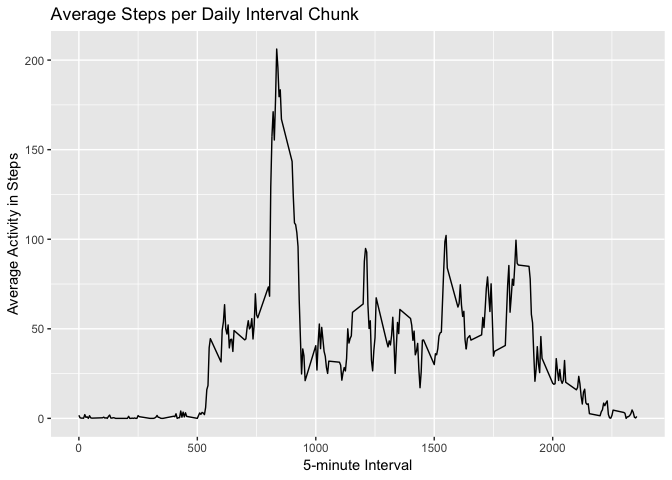
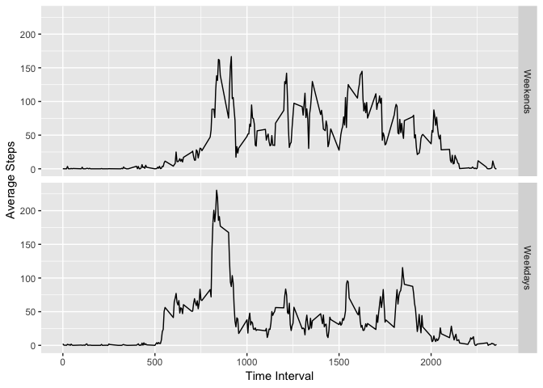

### Loading and preprocessing the data
Load the reqired libaries 


```r
library(dplyr)
library(readr)
library(ggplot2)
library(gridExtra)
```

Load the data into a dataframe

```r
url <- "https://d396qusza40orc.cloudfront.net/repdata%2Fdata%2Factivity.zip"

if(!file.exists("activity.csv")) {
  download.file(url, destfile="repdata%2Fdata%2Factivity.zip")
  unzip(zipfile ="repdata%2Fdata%2Factivity.zip" )
}
activityDF <- read_csv(file = "activity.csv")
```

### Histogram of total steps taken each day


```r
per_day <- activityDF %>% group_by(date) %>% summarize(daily_sum = sum(steps))
ggplot(data = per_day, aes(daily_sum)) + geom_histogram() + labs(x="Daily Steps", y="Frequency", main="Histogram of Daily Step Totals")
```

<!-- -->
  

```r
originalMean <- as.integer(mean(per_day$daily_sum, na.rm=TRUE))
originalMedian <- as.integer(median(per_day$daily_sum, na.rm=TRUE))
```
#### Mean daily steps over the recorded period  
Mean over the recorded period is **10766**
  
#### Median daily steps over recorded period
Median over the recorded period is **10765**


### Average Daily Activity Pattern


```r
act_by_intvl<- activityDF %>% 
  group_by(interval) %>% 
  summarize(mean_by_Interval = mean(steps, na.rm= TRUE))

ggplot(act_by_intvl, aes(x=act_by_intvl$interval, y=act_by_intvl$mean_by_Interval)) + 
  geom_line() + 
  labs(x="5-minute Interval", y= "Average Activity in Steps", title ="Average Steps per Daily Interval Chunk")
```

<!-- -->


The 5-minute interval that has the highest average activity is interval **835**.

### Imputing missing values
There are **2304** NA values for steps in the activity dataset.  
The code below will replace any NA values with the average of it's appropriate interval.  

```r
# Group By interval
# Then use if/else to replace NA step values with the mean of that interval

activityDF_imputed <- activityDF %>% 
  group_by(interval) %>% 
  mutate(steps = ifelse(is.na(steps),
                        mean(steps, na.rm=TRUE), #return mean of that group
                        as.numeric(steps))) #not NA? just return numeric value of steps at that position.
```

### After imputing missing values
There are now **0** NA values for steps in the activity dataset.  
In any interval that was missing step data had the NA replaced with that interval's mean across the dataset.


```r
per_day_imputed <- activityDF_imputed %>% group_by(date) %>% summarize(daily_sum = sum(steps))
ggplot(data = per_day_imputed, aes(daily_sum)) + geom_histogram() + labs(x="Daily Steps", y="Frequency", main="Histogram of Daily Step Totals")
```

<!-- -->
  

### Differences between averages with NAs and after imputing  


```r
imputedMean <- as.integer(mean(per_day_imputed$daily_sum, na.rm=TRUE))
imputedMedian <- as.integer(median(per_day_imputed$daily_sum, na.rm=TRUE))
percent_change_mean <- (imputedMean - originalMean)/originalMean
percent_change_median <- format((imputedMedian - originalMedian)/originalMedian, scientific=FALSE)
```
  

Originally the mean of total daily steps was **10766** after imputing it is **10766** for a **0** % change.  
The median of these daily step totas was **10765** after imputing it is **10766** for a **0.00009289364** % change.

### Are there differences in activity patterns between weekdays and weekends?

```r
# Make labeled factor of Weekend or Weekday
activityDF_imputed$weekend <- chron::is.weekend(activityDF_imputed$date) 
activityDF_imputed$weekend <- factor(activityDF_imputed$weekend, levels = c("TRUE", "FALSE"), labels=c("Weekends","Weekdays"))

# Split, Group and Summarize 
plotme <- activityDF_imputed %>% 
  group_by(weekend, interval) %>% 
  summarize(mean_by_interval = mean(steps, na.rm= TRUE))

# Plot
ggplot(plotme, aes(interval, mean_by_interval)) + 
  facet_grid(weekend~.) + 
  geom_line() + 
  labs(x="Time Interval",y="Average Steps", main="Weekend & Weekday Activity Compared")  
```

<!-- -->
